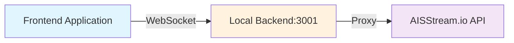
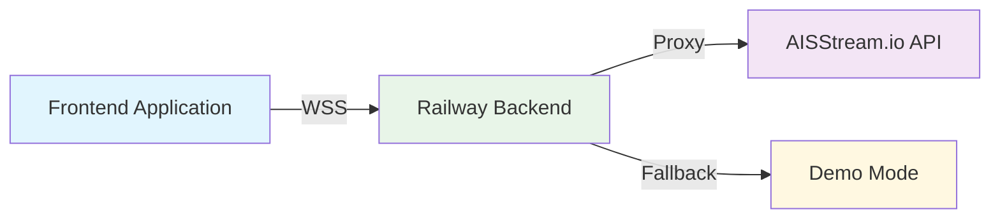
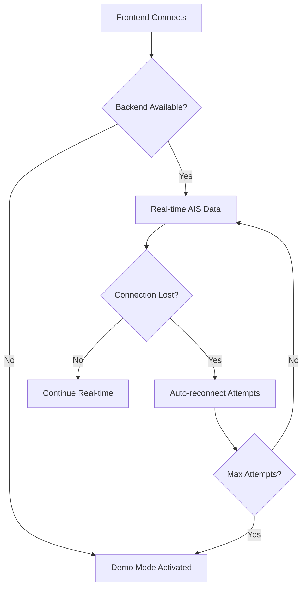
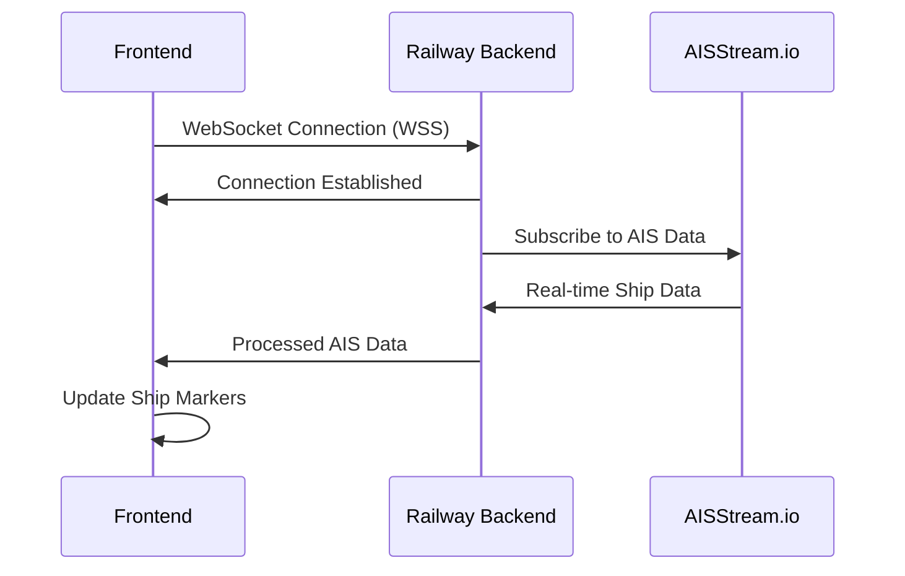

# Frontend Configuration Update Design

## Overview

This design document outlines the frontend configuration update required to connect the Istanbul Strait nautical map application to the production Railway backend instead of the local development environment. The update involves modifying the WebSocket URL configuration to enable real-time AIS data streaming in production.

## Technology Stack

- **Frontend**: HTML5 with embedded JavaScript
- **WebSocket Protocol**: Secure WebSocket (WSS)
- **Backend Platform**: Railway Cloud Platform
- **File Location**: `/Users/kagantatlici/Desktop/Bogaz_Harita_Qoder/istanbul_strait_nautical_map.html`

## Architecture

### Current Configuration Architecture



### Target Production Architecture



## Configuration Update Requirements

### Current Development Configuration

| Parameter | Current Value | Environment |
|-----------|---------------|-------------|
| Protocol | `ws://` | Development |
| Hostname | `localhost` | Local |
| Port | `3001` | Standard Node.js |
| Path | `/ais` | WebSocket endpoint |
| Backend Available | `true` | Local testing |

### Target Production Configuration

| Parameter | New Value | Environment |
|-----------|-----------|-------------|
| Protocol | `wss://` | Production (Secure) |
| Hostname | `istanbul-strait-map-production.up.railway.app` | Railway Platform |
| Port | `(default)` | Railway managed |
| Path | `/ais` | WebSocket endpoint |
| Backend Available | `true` | Production ready |

## Implementation Details

### AIS Configuration Object Location

The configuration object is located in the JavaScript section of the HTML file:

```javascript
// Line ~1852 in istanbul_strait_nautical_map.html
const AIS_CONFIG = {
    BACKEND_WS_URL: 'ws://localhost:3001/ais',  // <- UPDATE THIS
    BACKEND_AVAILABLE: true,
    // ... other configurations remain unchanged
};
```

### Configuration Update Specification

#### Exact Change Required

```javascript
// FROM (Development)
BACKEND_WS_URL: 'ws://localhost:3001/ais',

// TO (Production)
BACKEND_WS_URL: 'wss://istanbul-strait-map-production.up.railway.app/ais',
```

### Protocol Security Enhancement

| Aspect | Development | Production |
|--------|-------------|------------|
| **Security** | Unencrypted (`ws://`) | Encrypted (`wss://`) |
| **Certificate** | None | Railway-managed SSL |
| **Domain** | localhost | Production domain |
| **CORS** | Disabled | Properly configured |

## Configuration Validation

### Pre-Update Checklist

- [x] Identify current `AIS_CONFIG` object location
- [x] Verify current `BACKEND_WS_URL` value
- [x] Confirm Railway deployment domain
- [x] Validate WebSocket endpoint path

### Post-Update Validation

- [ ] WebSocket connection established successfully
- [ ] AIS data streaming functional
- [ ] Demo mode fallback operational
- [ ] No console errors related to connection
- [ ] UI status indicators working correctly

## Risk Assessment & Mitigation

### Potential Issues

| Risk | Impact | Mitigation Strategy |
|------|--------|-------------------|
| **Connection Failure** | No real-time AIS data | Automatic fallback to demo mode |
| **SSL Certificate Issues** | WebSocket connection blocked | Railway handles SSL automatically |
| **Domain Resolution** | Cannot reach backend | Railway provides stable domain |
| **CORS Restrictions** | Browser blocks connection | Backend proxy handles CORS headers |

### Fallback Mechanism

The application includes built-in fallback handling:



## Configuration Impact Analysis

### Unchanged Components

- All other `AIS_CONFIG` parameters remain identical
- `BACKEND_AVAILABLE: true` setting preserved
- WebSocket endpoint path `/ais` maintained
- Connection retry logic unchanged
- Demo mode fallback functionality intact

### Modified Components

- **Protocol**: Upgraded from `ws://` to `wss://` for production security
- **Hostname**: Changed from `localhost` to Railway production domain
- **Port**: Removed explicit port (Railway handles via standard HTTPS/WSS ports)

## Testing Strategy

### Connection Testing

1. **Initial Connection Test**
   - Frontend attempts WebSocket connection
   - Backend proxy responds with handshake
   - AIS data stream initialization

2. **Fallback Testing**
   - Simulate backend unavailability
   - Verify demo mode activation
   - Confirm UI status updates

3. **Reconnection Testing**
   - Test connection interruption scenarios
   - Validate automatic reconnection attempts
   - Ensure graceful degradation

### User Experience Validation

- AIS toggle switch functionality
- Ship marker updates and rendering
- Performance under real-time data load
- Mobile responsiveness maintained

## Deployment Workflow

### Configuration Update Process

1. **File Modification**
   - Open `istanbul_strait_nautical_map.html`
   - Locate `AIS_CONFIG` object (line ~1852)
   - Update `BACKEND_WS_URL` parameter
   - Save file changes

2. **Verification Steps**
   - Deploy updated file to production environment
   - Test WebSocket connection establishment
   - Verify AIS data reception
   - Confirm fallback functionality

3. **Monitoring**
   - Monitor connection stability
   - Check error logs for issues
   - Validate user experience metrics

## Technical Considerations

### WebSocket Connection Flow



### Security Enhancements

- **Encrypted Communication**: WSS protocol ensures data encryption in transit
- **API Key Protection**: Backend proxy prevents client-side API key exposure
- **CORS Compliance**: Proper CORS headers prevent unauthorized access
- **Certificate Validation**: Railway-managed SSL certificates ensure secure connections

## Performance Optimization

### Connection Efficiency

- Single WebSocket connection for all AIS data
- Efficient JSON message parsing
- Ship marker update batching
- Memory cleanup for inactive ships

### Resource Management

- Maximum ship limit: 50 active ships
- Automatic cleanup interval: 60 seconds
- Connection retry backoff strategy
- UI update throttling for smooth performance


