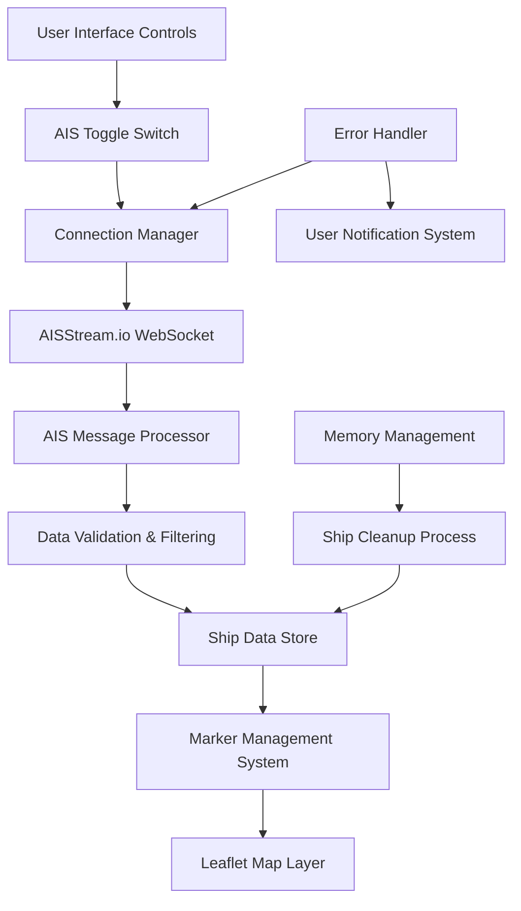
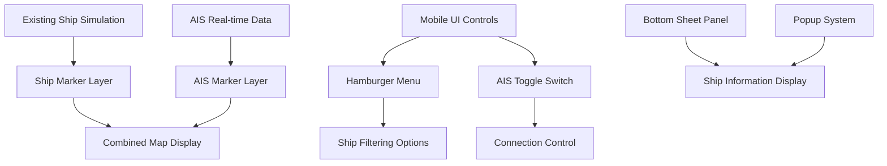

# Istanbul Strait AIS Integration Design

## Overview

This design document outlines the integration of AISStream.io real-time Automatic Identification System (AIS) data into the existing Istanbul Strait nautical map application. The implementation will provide live vessel tracking within the Istanbul Strait boundaries while maintaining the current mobile-first design and ship simulation functionality.

## Technology Stack & Dependencies

### External APIs
- **AISStream.io WebSocket API**: Primary data source for real-time AIS data
- **WebSocket Protocol**: Real-time bidirectional communication
- **Leaflet.js**: Map rendering and marker management

### Current Application Stack
- **Frontend**: Single HTML file with embedded CSS/JavaScript
- **Map Library**: Leaflet.js 1.9.4
- **Styling**: Mobile-first responsive design with nautical theme
- **Architecture**: Client-side only, no backend dependencies

## Architecture

### AIS Data Flow Architecture



### Component Integration Architecture



## API Integration Layer

### WebSocket Connection Management

#### Connection Parameters
```javascript
const AIS_CONFIG = {
    WS_URL: 'wss://stream.aisstream.io/v0/stream',
    API_KEY: 'd9f7e48524cd9b6f07f782a19968d1d01fda4274',
    BOUNDING_BOX: [40.85, 28.75, 41.25, 29.30], // Istanbul Strait boundaries
    RECONNECT_INTERVAL: 5000,
    MAX_RECONNECT_ATTEMPTS: 10
};
```

#### Subscription Message Format
```javascript
const subscriptionMessage = {
    APIKey: AIS_CONFIG.API_KEY,
    BoundingBoxes: [AIS_CONFIG.BOUNDING_BOX],
    FiltersShipAndCargo: true,
    FilterMessageTypes: ["PositionReport"]
};
```

### AIS Message Processing

#### Data Structure Definition
```javascript
interface AISShipData {
    mmsi: string;
    shipName: string;
    latitude: number;
    longitude: number;
    speed: number;
    heading: number;
    vesselType: string;
    timestamp: Date;
    lastUpdate: number;
}
```

#### Message Parser Implementation
```javascript
function processAISMessage(data) {
    const message = data.Message;
    if (!message || !message.PositionReport) return;
    
    const ship = {
        mmsi: message.UserID.toString(),
        shipName: message.MetaData?.ShipAndCargoType?.ShipName || 'Unknown',
        latitude: message.PositionReport.Latitude,
        longitude: message.PositionReport.Longitude,
        speed: message.PositionReport.SpeedOverGround || 0,
        heading: message.PositionReport.TrueHeading || 0,
        vesselType: getVesselType(message.MetaData?.ShipAndCargoType?.ShipAndCargoType),
        timestamp: new Date(message.MetaData?.time_utc),
        lastUpdate: Date.now()
    };
    
    updateShipData(ship);
}
```

## Data Models & State Management

### Ship Data Storage
```javascript
class AISDataManager {
    constructor() {
        this.shipData = new Map(); // MMSI -> AISShipData
        this.shipMarkers = new Map(); // MMSI -> Leaflet Marker
        this.maxShips = 50;
        this.cleanupInterval = 60000; // 60 seconds
    }
    
    addOrUpdateShip(shipData) {
        // Update existing or add new ship
        this.shipData.set(shipData.mmsi, shipData);
        this.updateMarker(shipData);
        this.enforceShipLimit();
    }
    
    cleanupOldShips() {
        const now = Date.now();
        for (const [mmsi, ship] of this.shipData.entries()) {
            if (now - ship.lastUpdate > this.cleanupInterval) {
                this.removeShip(mmsi);
            }
        }
    }
}
```

### Ship Marker Management
```javascript
class AISMarkerManager {
    createShipMarker(shipData) {
        const color = this.getShipColor(shipData.vesselType);
        const rotation = shipData.heading || 0;
        
        const marker = L.divIcon({
            className: 'ais-ship-marker',
            html: `<div class="ship-icon" style="color: ${color}; transform: rotate(${rotation}deg);">⬆</div>`,
            iconSize: [16, 16],
            iconAnchor: [8, 8]
        });
        
        return L.marker([shipData.latitude, shipData.longitude], {
            icon: marker,
            title: shipData.shipName
        });
    }
    
    getShipColor(vesselType) {
        const colors = {
            'cargo': '#2196F3',     // Blue
            'tanker': '#F44336',    // Red
            'passenger': '#4CAF50', // Green
            'default': '#9E9E9E'    // Gray
        };
        return colors[vesselType?.toLowerCase()] || colors.default;
    }
}
```

## Mobile-First UI Components

### AIS Toggle Switch Design
```css
.ais-toggle-container {
    position: fixed;
    top: 70px;
    right: 20px;
    z-index: 1000;
    background: linear-gradient(135deg, rgba(0, 0, 0, 0.9), rgba(0, 50, 100, 0.9));
    padding: 8px 12px;
    border-radius: 20px;
    border: 2px solid rgba(255, 255, 255, 0.3);
    box-shadow: 0 4px 15px rgba(0,0,0,0.5);
}

.ais-toggle-switch {
    position: relative;
    width: 60px;
    height: 34px;
}

.ais-toggle-switch input {
    opacity: 0;
    width: 0;
    height: 0;
}

.ais-slider {
    position: absolute;
    cursor: pointer;
    top: 0;
    left: 0;
    right: 0;
    bottom: 0;
    background-color: #334155;
    transition: 0.4s;
    border-radius: 34px;
}

.ais-slider:before {
    position: absolute;
    content: "";
    height: 26px;
    width: 26px;
    left: 4px;
    bottom: 4px;
    background-color: white;
    transition: 0.4s;
    border-radius: 50%;
}

input:checked + .ais-slider {
    background-color: #2196F3;
}

input:checked + .ais-slider:before {
    transform: translateX(26px);
}
```

### Ship Information Popup
```javascript
function createAISPopup(shipData) {
    const formatSpeed = (speed) => speed ? `${speed.toFixed(1)} knots` : 'N/A';
    const formatHeading = (heading) => heading ? `${heading}°` : 'N/A';
    const formatTime = (timestamp) => {
        return new Date(timestamp).toLocaleTimeString('tr-TR', {
            hour: '2-digit',
            minute: '2-digit',
            second: '2-digit'
        });
    };
    
    return `
        <div class="ais-popup-content">
            <div class="popup-header">
                <strong>🚢 ${shipData.shipName}</strong>
            </div>
            <div class="popup-info">
                <div class="info-row">
                    <span class="label">📍 Konum:</span>
                    <span class="value">${shipData.latitude.toFixed(4)}, ${shipData.longitude.toFixed(4)}</span>
                </div>
                <div class="info-row">
                    <span class="label">⚡ Hız:</span>
                    <span class="value">${formatSpeed(shipData.speed)}</span>
                </div>
                <div class="info-row">
                    <span class="label">🧭 Yön:</span>
                    <span class="value">${formatHeading(shipData.heading)}</span>
                </div>
                <div class="info-row">
                    <span class="label">📋 Tip:</span>
                    <span class="value">${shipData.vesselType}</span>
                </div>
                <div class="info-row">
                    <span class="label">🆔 MMSI:</span>
                    <span class="value">${shipData.mmsi}</span>
                </div>
                <div class="info-row">
                    <span class="label">⏰ Güncelleme:</span>
                    <span class="value">${formatTime(shipData.timestamp)}</span>
                </div>
            </div>
        </div>
    `;
}
```

### Hamburger Menu Integration
```javascript
function addAISControlsToMenu() {
    const menuContent = document.getElementById('hamburgerMenuContent');
    
    const aisSection = document.createElement('div');
    aisSection.className = 'menu-section';
    aisSection.innerHTML = `
        <h4>Gemi Takibi</h4>
        <div class="menu-item">
            <label class="mobile-toggle">
                <input type="checkbox" id="aisToggle">
                <span class="mobile-toggle-slider"></span>
                AIS Tracking
            </label>
        </div>
        <div class="menu-item ship-filter-section" id="shipFilterSection" style="display: none;">
            <h5>Gemi Tipleri</h5>
            <label class="filter-checkbox">
                <input type="checkbox" id="cargoFilter" checked>
                <span>Kargo Gemileri</span>
            </label>
            <label class="filter-checkbox">
                <input type="checkbox" id="tankerFilter" checked>
                <span>Tankerler</span>
            </label>
            <label class="filter-checkbox">
                <input type="checkbox" id="passengerFilter" checked>
                <span>Yolcu Gemileri</span>
            </label>
            <label class="filter-checkbox">
                <input type="checkbox" id="otherFilter" checked>
                <span>Diğer</span>
            </label>
        </div>
    `;
    
    menuContent.appendChild(aisSection);
}
```

## State Management & Performance

### Connection State Management
```javascript
class AISConnectionManager {
    constructor() {
        this.websocket = null;
        this.connectionState = 'disconnected'; // disconnected, connecting, connected, error
        this.reconnectAttempts = 0;
        this.isEnabled = false;
    }
    
    connect() {
        if (this.connectionState === 'connected' || this.connectionState === 'connecting') {
            return;
        }
        
        this.connectionState = 'connecting';
        this.updateUI('AIS Bağlantısı kuruluyor...');
        
        try {
            this.websocket = new WebSocket(AIS_CONFIG.WS_URL);
            this.setupEventHandlers();
        } catch (error) {
            this.handleConnectionError(error);
        }
    }
    
    setupEventHandlers() {
        this.websocket.onopen = () => {
            this.connectionState = 'connected';
            this.reconnectAttempts = 0;
            this.sendSubscription();
            this.updateUI(`AIS Aktif - ${this.getActiveShipCount()} gemi`);
        };
        
        this.websocket.onmessage = (event) => {
            try {
                const data = JSON.parse(event.data);
                this.processAISMessage(data);
            } catch (error) {
                console.error('AIS message parse error:', error);
            }
        };
        
        this.websocket.onerror = (error) => {
            this.handleConnectionError(error);
        };
        
        this.websocket.onclose = () => {
            this.connectionState = 'disconnected';
            if (this.isEnabled && this.reconnectAttempts < AIS_CONFIG.MAX_RECONNECT_ATTEMPTS) {
                setTimeout(() => this.reconnect(), AIS_CONFIG.RECONNECT_INTERVAL);
            }
        };
    }
}
```

### Memory Management System
```javascript
class AISMemoryManager {
    constructor(dataManager) {
        this.dataManager = dataManager;
        this.cleanupInterval = null;
        this.maxMemoryUsage = 50 * 1024 * 1024; // 50MB limit
    }
    
    startCleanupProcess() {
        this.cleanupInterval = setInterval(() => {
            this.cleanupOldShips();
            this.enforceMemoryLimits();
        }, 30000); // Every 30 seconds
    }
    
    cleanupOldShips() {
        const now = Date.now();
        let removedCount = 0;
        
        for (const [mmsi, ship] of this.dataManager.shipData.entries()) {
            if (now - ship.lastUpdate > 60000) { // 60 seconds
                this.dataManager.removeShip(mmsi);
                removedCount++;
            }
        }
        
        if (removedCount > 0) {
            console.log(`Cleaned up ${removedCount} inactive ships`);
        }
    }
    
    enforceMemoryLimits() {
        const shipCount = this.dataManager.shipData.size;
        if (shipCount > this.dataManager.maxShips) {
            // Remove oldest ships
            const sortedShips = Array.from(this.dataManager.shipData.entries())
                .sort((a, b) => a[1].lastUpdate - b[1].lastUpdate);
            
            const toRemove = shipCount - this.dataManager.maxShips;
            for (let i = 0; i < toRemove; i++) {
                this.dataManager.removeShip(sortedShips[i][0]);
            }
        }
    }
}
```

## Error Handling & User Experience

### Error State Management
```javascript
class AISErrorHandler {
    constructor(uiManager) {
        this.uiManager = uiManager;
        this.errorStates = {
            WEBSOCKET_ERROR: 'WebSocket bağlantı hatası',
            INVALID_API_KEY: 'API key geçersiz',
            RATE_LIMIT: 'Rate limit aşıldı',
            NETWORK_ERROR: 'Ağ bağlantı sorunu',
            PARSE_ERROR: 'Veri ayrıştırma hatası'
        };
    }
    
    handleError(errorType, details) {
        const message = this.errorStates[errorType] || 'Bilinmeyen hata';
        
        this.uiManager.showErrorMessage(message);
        this.logError(errorType, details);
        
        // Implement retry logic for recoverable errors
        if (this.isRecoverableError(errorType)) {
            this.scheduleRetry(errorType);
        }
    }
    
    isRecoverableError(errorType) {
        return ['WEBSOCKET_ERROR', 'NETWORK_ERROR'].includes(errorType);
    }
    
    scheduleRetry(errorType) {
        const retryDelay = this.getRetryDelay(errorType);
        setTimeout(() => {
            if (this.shouldRetry()) {
                this.attemptRecovery(errorType);
            }
        }, retryDelay);
    }
}
```

### User Interface States
```javascript
class AISUIManager {
    constructor() {
        this.statusDisplay = null;
        this.loadingIndicator = null;
        this.errorDisplay = null;
    }
    
    updateConnectionStatus(status, details = '') {
        const statusElement = document.getElementById('aisStatus');
        if (!statusElement) return;
        
        switch (status) {
            case 'connecting':
                statusElement.innerHTML = '🔄 AIS Bağlantısı kuruluyor...';
                statusElement.className = 'ais-status connecting';
                break;
                
            case 'connected':
                const shipCount = details.shipCount || 0;
                statusElement.innerHTML = `✅ AIS Aktif - ${shipCount} gemi`;
                statusElement.className = 'ais-status connected';
                break;
                
            case 'disconnected':
                statusElement.innerHTML = '❌ AIS Bağlantısı kapalı';
                statusElement.className = 'ais-status disconnected';
                break;
                
            case 'error':
                statusElement.innerHTML = `⚠️ ${details.message} - Tekrar dene`;
                statusElement.className = 'ais-status error';
                break;
                
            case 'no_data':
                statusElement.innerHTML = '📡 Bölgede gemi bulunamadı';
                statusElement.className = 'ais-status no-data';
                break;
        }
    }
}
```

## Testing Strategy

### Unit Testing Approach
```javascript
// Test Data Validation
describe('AIS Data Processing', () => {
    test('should validate ship data structure', () => {
        const mockAISData = {
            Message: {
                UserID: 123456789,
                PositionReport: {
                    Latitude: 41.0082,
                    Longitude: 28.9784,
                    SpeedOverGround: 12.5,
                    TrueHeading: 45
                },
                MetaData: {
                    ShipName: 'Test Ship',
                    time_utc: '2024-01-01T12:00:00Z'
                }
            }
        };
        
        const result = processAISMessage(mockAISData);
        expect(result.mmsi).toBe('123456789');
        expect(result.latitude).toBe(41.0082);
        expect(result.speed).toBe(12.5);
    });
});

// Test WebSocket Connection
describe('AIS Connection Management', () => {
    test('should handle connection failures gracefully', () => {
        const connectionManager = new AISConnectionManager();
        const mockError = new Error('Connection failed');
        
        connectionManager.handleConnectionError(mockError);
        expect(connectionManager.connectionState).toBe('error');
    });
});

// Test Memory Management
describe('AIS Memory Management', () => {
    test('should cleanup old ships after timeout', () => {
        const dataManager = new AISDataManager();
        const memoryManager = new AISMemoryManager(dataManager);
        
        // Add old ship data
        const oldShip = {
            mmsi: '123456789',
            lastUpdate: Date.now() - 120000 // 2 minutes ago
        };
        
        dataManager.shipData.set(oldShip.mmsi, oldShip);
        memoryManager.cleanupOldShips();
        
        expect(dataManager.shipData.has(oldShip.mmsi)).toBe(false);
    });
});
```

### Integration Testing
```javascript
// Test AIS Integration with Existing Ship Simulation
describe('AIS Integration', () => {
    test('should not conflict with existing ship simulation', () => {
        // Initialize both systems
        const simulationManager = new ShipSimulationManager();
        const aisManager = new AISDataManager();
        
        // Add simulation ship
        simulationManager.addShip(mockSimulationShip);
        
        // Add AIS ship
        aisManager.addOrUpdateShip(mockAISShip);
        
        // Verify both are displayed without conflicts
        const simulationMarkers = document.querySelectorAll('.ship-marker');
        const aisMarkers = document.querySelectorAll('.ais-ship-marker');
        
        expect(simulationMarkers.length).toBeGreaterThan(0);
        expect(aisMarkers.length).toBeGreaterThan(0);
    });
});
```

### Performance Testing
```javascript
// Test Performance with Multiple Ships
describe('AIS Performance', () => {
    test('should handle 50 ships without performance degradation', () => {
        const startTime = performance.now();
        const dataManager = new AISDataManager();
        
        // Add 50 ships
        for (let i = 0; i < 50; i++) {
            dataManager.addOrUpdateShip(generateMockShip(i));
        }
        
        const endTime = performance.now();
        const duration = endTime - startTime;
        
        expect(duration).toBeLessThan(100); // Should complete in less than 100ms
        expect(dataManager.shipData.size).toBe(50);
    });
});
```