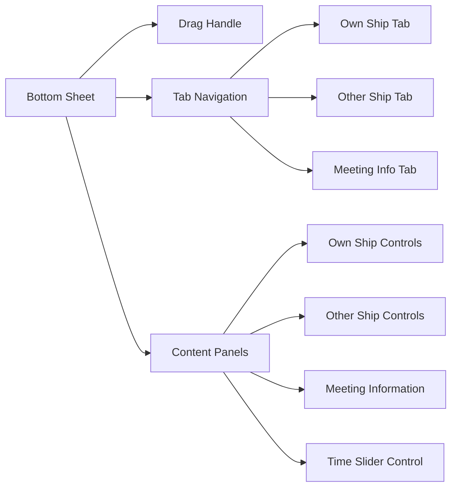
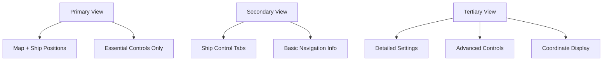
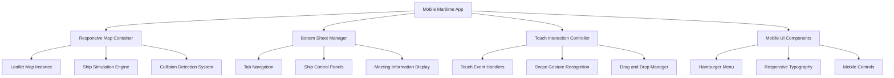

# Mobile Responsiveness Enhancement for Istanbul Strait Nautical Map

## Overview

Transform the existing Istanbul Strait Nautical Map with dual ship simulation into a fully mobile-responsive maritime application optimized for professional maritime use on mobile devices. The current single HTML file implementation contains overlapping UI elements and requires comprehensive mobile optimization while maintaining all existing functionality.

### Current State Analysis
- Single HTML file with embedded CSS/JavaScript architecture
- Dual ship simulation system with collision detection
- Absolute-positioned control panels causing mobile overlap issues
- Turkish nautical interface with Courier New typography
- Desktop-optimized UI elements and touch targets
- Complex control layout unsuitable for mobile interaction

### Target Outcome
A professional mobile-responsive nautical map application that maritime professionals can operate effectively on smartphones and tablets with intuitive touch controls, clear information hierarchy, and preserved dual ship simulation accuracy.

## Technology Stack & Dependencies

### Core Framework
- **Leaflet.js 1.9.4**: Primary mapping library
- **Pure CSS3**: Responsive design implementation
- **Vanilla JavaScript**: Ship simulation and interaction logic
- **Single HTML File**: Maintain existing architecture

### Mobile-Specific Technologies
- **CSS Grid & Flexbox**: Responsive layout system
- **CSS Media Queries**: Breakpoint-based responsive design
- **Touch Events API**: Enhanced mobile interaction
- **CSS Transforms**: Smooth animations and transitions
- **Viewport Meta Tag**: Proper mobile scaling

## Responsive Layout Architecture

### Breakpoint Strategy
```css
/* Mobile First Approach */
/* Small Mobile: 320px - 480px */
@media screen and (max-width: 480px)

/* Large Mobile: 481px - 768px */  
@media screen and (min-width: 481px) and (max-width: 768px)

/* Tablet: 769px - 1024px */
@media screen and (min-width: 769px) and (max-width: 1024px)

/* Desktop: 1025px+ */
@media screen and (min-width: 1025px)
```

### Layout Transformation Matrix

| Component | Desktop Layout | Mobile Layout |
|-----------|----------------|---------------|
| Map Container | 100vh/100vw | 100vh/100vw |
| Ship Control Panel | Fixed bottom-left | Swipeable bottom sheet |
| Coordinate Display | Fixed bottom-left | Hidden by default |
| Layer Controls | Fixed top-right | Hamburger menu |
| Title | Fixed top-left | Responsive typography |
| Ship Toggle | Fixed bottom positioning | Integrated in bottom sheet |

### Mobile Layout Grid System

```mermaid
graph TD
    A[Map Container - 100vh] --> B[Top Navigation Bar - 60px]
    A --> C[Map View Area - calc(100vh - 60px - 200px)]
    A --> D[Bottom Sheet Container - 200px]
    
    B --> E[Title - Left Aligned]
    B --> F[Hamburger Menu - Right Aligned]
    
    D --> G[Drag Handle - 44px]
    D --> H[Tabbed Interface - 44px]
    D --> I[Content Area - Flexible]
    
    F --> J[Layer Controls]
    F --> K[Coordinate Display]
    F --> L[Settings Panel]
```

## Bottom Sheet Control Panel Design

### Bottom Sheet Architecture


### Tab Interface Specification

#### Tab 1: Own Ship Control
- **Direction Selector**: Touch-optimized buttons (44px minimum)
- **Speed Input**: Large numeric input with stepper controls
- **Current Status**: Real-time position and heading display
- **Route Information**: Next waypoint and ETA

#### Tab 2: Other Ship Control
- **Direction Selector**: Mirrored layout from Own Ship
- **Speed Input**: Consistent styling with Own Ship
- **Current Status**: Real-time position and heading display
- **Route Information**: Next waypoint and ETA

#### Tab 3: Meeting Info
- **Meeting Warning Display**: Prominent collision alerts
- **Meeting Time**: Countdown to potential collision
- **Distance Information**: Current separation distance
- **Meeting Point Visualization**: Map marker reference

### Bottom Sheet States
- **Collapsed**: 80px height showing only drag handle and active tab
- **Partial**: 200px height showing tab content
- **Expanded**: 400px height showing full content with scrolling

## Touch-Optimized Elements

### Touch Target Specifications

| Element Type | Minimum Size | Recommended Size | Implementation |
|--------------|--------------|------------------|----------------|
| Ship Markers | 36px × 36px | 44px × 44px | Enhanced drag zones |
| Tab Buttons | 44px × 44px | 48px × 48px | Full-width touch areas |
| Slider Handles | 44px × 44px | 48px × 48px | Enlarged thumb controls |
| Input Fields | 44px height | 48px height | Increased padding |
| Menu Buttons | 44px × 44px | 48px × 48px | Icon + text layout |

### Enhanced Ship Marker Design
```css
.ship-marker-mobile {
    width: 44px;
    height: 44px;
    border-radius: 50%;
    cursor: pointer;
    touch-action: manipulation;
    box-shadow: 0 4px 12px rgba(0,0,0,0.3);
    transition: transform 0.2s ease;
}

.ship-marker-mobile:active {
    transform: scale(1.1);
}
```

### Touch Interaction Enhancements
- **Visual Feedback**: Scale animation on touch
- **Haptic-style Feedback**: CSS transitions simulating device haptics
- **Improved Drag Sensitivity**: Enhanced touch event handling
- **Gesture Support**: Swipe controls for time slider

## Mobile-First Information Hierarchy

### Progressive Disclosure Pattern



### Information Priority Levels

#### Priority 1 (Always Visible)
- Map visualization
- Ship positions and movements
- Active collision warnings
- Current simulation time

#### Priority 2 (Bottom Sheet - Primary)
- Ship direction and speed controls
- Time slider control
- Meeting information display

#### Priority 3 (Hamburger Menu)
- Layer opacity controls
- Coordinate display toggle
- Dark mode settings
- Advanced configurations

### Hamburger Menu Structure
```
☰ Menu
├── 🌊 Layer Controls
│   ├── OpenSeaMap Opacity: [slider]
│   └── TSS Visibility: [toggle]
├── 📍 Coordinates
│   └── Current Position: [display]
├── 🌙 Dark Mode
│   └── Toggle: [switch]
└── ⚙️ Settings
    ├── Performance Mode
    └── Debug Information
```

## Responsive Typography & Styling

### Typography Scale System

| Screen Size | Base Font | Headings | UI Labels | Coordinates |
|-------------|-----------|----------|-----------|-------------|
| 320px-480px | 14px | 16px-18px | 12px | 11px |
| 481px-768px | 15px | 17px-20px | 13px | 12px |
| 769px-1024px | 16px | 18px-22px | 14px | 13px |
| 1025px+ | 16px | 18px-24px | 14px | 14px |

### Nautical Font Implementation
```css
/* Maintain Courier New throughout all breakpoints */
.nautical-text {
    font-family: 'Courier New', 'Courier', monospace;
    letter-spacing: 0.5px;
    font-weight: normal;
}

/* Responsive font scaling */
@media screen and (max-width: 480px) {
    .nautical-text { font-size: 12px; }
    .nautical-text.heading { font-size: 14px; }
}
```

### Color Scheme Adaptation
- **Primary Blue**: #2196F3 (Own Ship)
- **Secondary Orange**: #FF9800 (Other Ship) 
- **Warning Red**: #FF5252 (Collision alerts)
- **Background Dark**: rgba(0, 0, 0, 0.9) with nautical gradient
- **Text Light**: #ffffff with appropriate contrast ratios

## Mobile-Specific Features

### Swipe Gesture Implementation
```javascript
// Time slider swipe control
class SwipeTimeControl {
    constructor(element) {
        this.element = element;
        this.startX = 0;
        this.currentX = 0;
        this.isDragging = false;
    }
    
    handleTouchStart(e) {
        this.startX = e.touches[0].clientX;
        this.isDragging = true;
    }
    
    handleTouchMove(e) {
        if (!this.isDragging) return;
        this.currentX = e.touches[0].clientX;
        const deltaX = this.currentX - this.startX;
        this.updateTimeSlider(deltaX);
    }
}
```

### Touch Event Optimization
- **Passive Event Listeners**: Improved scroll performance
- **Touch-action CSS**: Prevent unwanted browser behaviors
- **Debounced Updates**: Optimize ship position calculations
- **RAF Animation**: Smooth 60fps performance

### Haptic-Style Feedback System
```css
/* CSS-based haptic feedback simulation */
.haptic-feedback {
    transition: transform 0.1s ease-out;
}

.haptic-feedback:active {
    transform: scale(0.95);
}

.haptic-success {
    animation: successPulse 0.3s ease-out;
}

@keyframes successPulse {
    0% { transform: scale(1); }
    50% { transform: scale(1.05); }
    100% { transform: scale(1); }
}
```

## Performance Optimization

### Mobile Performance Strategies

#### Rendering Optimization
- **CSS Hardware Acceleration**: Transform3d for ship markers
- **Reduced Paint Operations**: Optimized CSS transitions
- **Efficient DOM Updates**: Batch updates for ship positions
- **Memory Management**: Proper event listener cleanup

#### Touch Event Performance
```javascript
// Optimized touch handling
function optimizedTouchHandler() {
    let rafId = null;
    
    return function(e) {
        if (rafId) return;
        
        rafId = requestAnimationFrame(() => {
            processShipDrag(e);
            rafId = null;
        });
    };
}
```

#### Ship Simulation Performance
- **Throttled Calculations**: Limit update frequency to 30fps on mobile
- **Simplified Collision Detection**: Optimize distance calculations
- **Conditional Rendering**: Hide non-essential elements during animation

### Memory Management
- **Event Listener Cleanup**: Proper removal on component destruction
- **Marker Pooling**: Reuse ship marker instances
- **Efficient Route Calculations**: Cache waypoint calculations

## Implementation Architecture

### Component Structure


### CSS Architecture
```css
/* Mobile-first responsive framework */
.mobile-app {
    /* Base mobile styles */
    display: flex;
    flex-direction: column;
    height: 100vh;
    overflow: hidden;
}

.map-container {
    flex: 1;
    position: relative;
}

.bottom-sheet {
    position: fixed;
    bottom: 0;
    left: 0;
    right: 0;
    transform: translateY(calc(100% - 80px));
    transition: transform 0.3s ease-out;
}

.bottom-sheet.expanded {
    transform: translateY(0);
}
```

### JavaScript Module Structure
```javascript
// Modular mobile-optimized architecture
class MobileMaritime {
    constructor() {
        this.mapManager = new MapManager();
        this.bottomSheet = new BottomSheetManager();
        this.touchController = new TouchController();
        this.shipSimulation = new ShipSimulationEngine();
    }
    
    init() {
        this.setupResponsiveBreakpoints();
        this.initializeComponents();
        this.bindMobileEvents();
    }
}
```

## Testing Strategy

### Mobile Testing Framework

#### Device Testing Matrix
| Device Category | Screen Sizes | Orientation | Test Priority |
|-----------------|--------------|-------------|---------------|
| Small Phones | 320px-414px | Portrait/Landscape | High |
| Large Phones | 415px-480px | Portrait/Landscape | High |
| Small Tablets | 481px-768px | Portrait/Landscape | Medium |
| Large Tablets | 769px-1024px | Portrait/Landscape | Medium |

#### Touch Interaction Testing
- **Ship Dragging**: Verify smooth marker movement
- **Bottom Sheet**: Test swipe gestures and tab switching
- **Time Slider**: Validate swipe-based time control
- **Collision Detection**: Ensure warnings display correctly

#### Performance Testing
- **Frame Rate**: Maintain 60fps during ship animation
- **Memory Usage**: Monitor for memory leaks during extended use
- **Battery Impact**: Optimize for minimal battery drain
- **Network Performance**: Test with various connection speeds

### Accessibility Considerations
- **Touch Target Sizes**: Minimum 44px for all interactive elements
- **Color Contrast**: WCAG AA compliance for all text
- **Screen Reader Support**: Proper ARIA labels for ship controls
- **Keyboard Navigation**: Support for external keyboard input

## Integration Requirements

### Existing Functionality Preservation
- **Dual Ship Simulation**: Maintain all current simulation accuracy
- **Turkish Language Interface**: Preserve all Turkish labels and text
- **Collision Detection**: Keep existing collision warning system
- **TSS Visualization**: Maintain Traffic Separation Scheme display
- **Coordinate System**: Preserve WGS-84 coordinate accuracy

### Single File Architecture Maintenance
- **No External Dependencies**: All code remains in single HTML file
- **Embedded Styles**: CSS remains in `<style>` block
- **Inline Scripts**: JavaScript functionality in `<script>` block
- **Self-Contained**: No external resource dependencies beyond CDN libraries

## Technical Implementation Specifications

### Media Query Implementation
```css
/* Progressive enhancement approach */
@media screen and (max-width: 768px) {
    .ship-control-panel {
        position: fixed;
        bottom: 0;
        left: 0;
        right: 0;
        transform: translateY(calc(100% - 80px));
        min-width: unset;
        width: 100%;
        border-radius: 16px 16px 0 0;
        max-height: 60vh;
        overflow-y: auto;
    }
    
    .coordinate-display {
        display: none; /* Hidden by default on mobile */
    }
    
    .map-title {
        font-size: 14px;
        padding: 8px 12px;
    }
}
```

### Touch Event Integration
```javascript
// Enhanced ship marker touch handling
function initializeMobileShipControls() {
    ships.forEach(ship => {
        if (ship.marker) {
            const markerElement = ship.marker.getElement();
            
            // Add touch event listeners
            markerElement.addEventListener('touchstart', handleShipTouchStart, { passive: false });
            markerElement.addEventListener('touchmove', handleShipTouchMove, { passive: false });
            markerElement.addEventListener('touchend', handleShipTouchEnd);
            
            // Enhance marker for mobile
            markerElement.style.width = '44px';
            markerElement.style.height = '44px';
            markerElement.style.touchAction = 'manipulation';
        }
    });
}
```

### Bottom Sheet Implementation
```javascript
class BottomSheetController {
    constructor() {
        this.isExpanded = false;
        this.startY = 0;
        this.currentY = 0;
        this.dragHandle = document.getElementById('bottomSheetDragHandle');
        this.bottomSheet = document.getElementById('shipControlPanel');
    }
    
    initialize() {
        this.addEventListeners();
        this.setupTabs();
    }
    
    addEventListeners() {
        this.dragHandle.addEventListener('touchstart', this.handleTouchStart.bind(this));
        this.dragHandle.addEventListener('touchmove', this.handleTouchMove.bind(this));
        this.dragHandle.addEventListener('touchend', this.handleTouchEnd.bind(this));
    }
}
```

This comprehensive design provides a complete roadmap for transforming the Istanbul Strait Nautical Map into a fully mobile-responsive maritime application while preserving all existing functionality and maintaining the single-file architecture.


