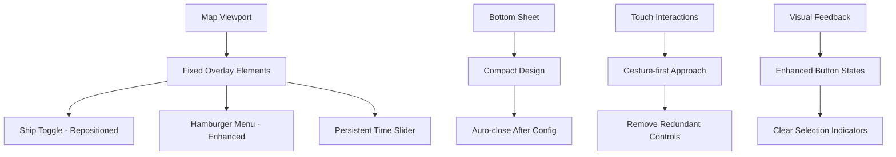
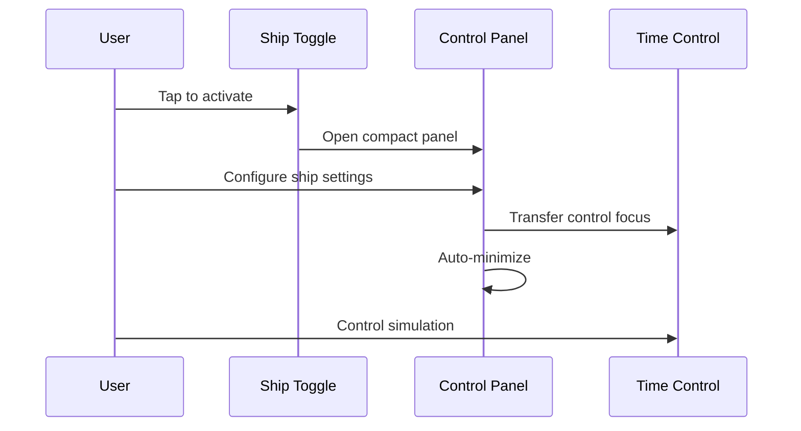
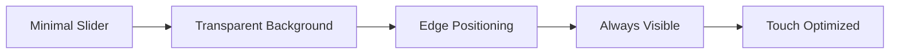
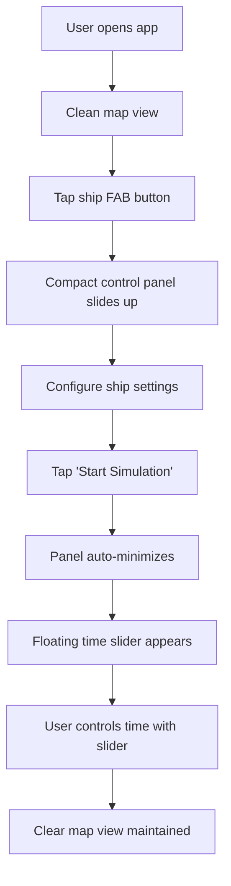
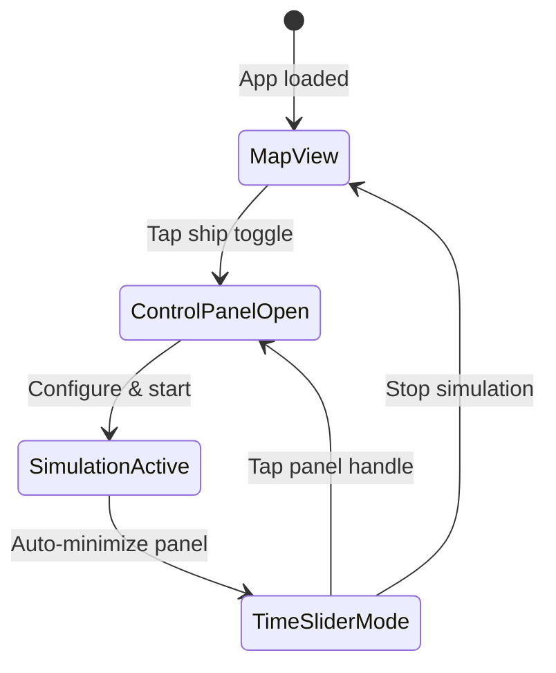

# Mobile UI Enhancements Design
## Istanbul Strait Nautical Map Application

### Overview
This design document outlines critical mobile UI improvements for the Istanbul Strait nautical map application, addressing user experience issues with the current ship simulator interface, control positioning, and interaction patterns. The goal is to create a more intuitive, space-efficient, and user-friendly mobile interface while maintaining nautical functionality.

### Current Issues Analysis

#### 1. Ship Simulator Button Positioning
- **Problem**: Ship simulation toggle button is centrally positioned, interfering with map interaction
- **Impact**: Blocks important map areas and creates accessibility issues
- **User Feedback**: "ship simulator butonu çok ortada"

#### 2. Bottom Sheet Space Consumption
- **Problem**: Ship controls bottom sheet occupies 45% of screen height in expanded state
- **Impact**: Obscures ships and map when controls are open, limiting visibility
- **User Feedback**: "ekranın yarısını kapattığı için arkada gemileri ve haritayı göremiyorum"

#### 3. Redundant Zoom Controls
- **Problem**: Manual zoom +/- buttons coexist with native pinch gestures
- **Impact**: Unnecessary UI clutter when pinch-to-zoom is available
- **User Feedback**: "zoom +- tuşlarını komple kaldırabiliriz"

#### 4. Direction Button Selection Issues
- **Problem**: Direction button highlighting doesn't provide clear visual feedback
- **Impact**: Users cannot clearly see which direction is selected
- **User Feedback**: "direction butonlarının seçildiğinde mavi renkle belirginleşmesi hala çalışmıyor"

#### 5. Inefficient Control Workflow
- **Problem**: Ship controls panel remains open throughout simulation
- **Impact**: Continuous screen obstruction after initial configuration
- **User Feedback**: Need time slider separated from main controls for persistent access

### Technology Stack
- **Frontend**: Single HTML file with embedded CSS/JavaScript
- **Map Library**: Leaflet.js v1.9.4
- **UI Framework**: Custom CSS with mobile-first approach
- **Target Platform**: Mobile-only (100% mobile usage)

### Mobile UI Enhancement Architecture

#### Component Reorganization Strategy



#### 1. Ship Simulator Button Repositioning

**Current State:**
```css
.ship-toggle {
    position: fixed;
    bottom: 210px;
    left: 50%;
    transform: translateX(-50%);
}
```

**Enhanced Design:**
```css
.ship-toggle-enhanced {
    position: fixed;
    bottom: 20px;
    right: 20px;
    width: 56px;
    height: 56px;
    border-radius: 50%;
    z-index: 1500;
}
```

**Features:**
- Move to bottom-right corner as floating action button
- Reduce visual prominence while maintaining accessibility
- Use nautical icon with compact text
- Implement state-aware styling (active/inactive)

#### 2. Compact Bottom Sheet Design

**Space Optimization Strategy:**

| Current Design | Enhanced Design |
|---------------|-----------------|
| 45vh max-height | 30vh max-height |
| Always visible header | Collapsible header |
| Persistent open state | Auto-close workflow |
| Full-width tabs | Compact control groups |

**Implementation Approach:**


#### 3. Native Gesture-First Approach

**Zoom Control Removal:**
- Remove Leaflet's default zoom buttons
- Rely entirely on pinch-to-zoom gestures
- Free up screen real estate in top-right corner
- Maintain zoom programmatically for accessibility

**Implementation:**
```css
.leaflet-control-zoom {
    display: none !important;
}
```

#### 4. Enhanced Direction Button Feedback

**Visual State System:**

| State | Background | Border | Text Color | Icon |
|-------|------------|--------|------------|------|
| Default | rgba(255,255,255,0.1) | rgba(255,255,255,0.3) | rgba(255,255,255,0.7) | ⬆️/⬇️ |
| Selected | #0078ff | #0078ff | #ffffff | ⬆️/⬇️ |
| Active Touch | #0056b3 | #0056b3 | #ffffff | ⬆️/⬇️ |

**CSS Implementation:**
```css
.direction-option {
    transition: all 0.2s ease;
    background: rgba(255, 255, 255, 0.1);
    border: 1px solid rgba(255, 255, 255, 0.3);
}

.direction-option.selected {
    background: #0078ff !important;
    border-color: #0078ff !important;
    color: #ffffff !important;
    box-shadow: 0 0 12px rgba(0, 120, 255, 0.4);
}
```

#### 5. Persistent Time Slider Design

**Floating Time Control:**



**Specifications:**
- Position: Fixed bottom edge, above navigation gestures
- Height: 8px track, 24px thumb for touch accessibility
- Width: 80% of screen width, centered
- Background: Semi-transparent with nautical styling
- Auto-hide after 3 seconds of inactivity
- Show on touch interaction

### Detailed Component Specifications

#### Enhanced Ship Toggle Button

**Design Specifications:**
```css
.ship-toggle-fab {
    position: fixed;
    bottom: 80px;
    right: 20px;
    width: 56px;
    height: 56px;
    border-radius: 50%;
    background: linear-gradient(135deg, #1565C0, #0D47A1);
    color: white;
    border: none;
    box-shadow: 0 4px 16px rgba(0,0,0,0.3);
    font-size: 20px;
    transition: all 0.3s ease;
    z-index: 1500;
}

.ship-toggle-fab:active {
    transform: scale(0.95);
    box-shadow: 0 2px 8px rgba(0,0,0,0.3);
}

.ship-toggle-fab.active {
    background: linear-gradient(135deg, #0078ff, #0056b3);
    animation: pulse 2s infinite;
}
```

#### Compact Control Panel

**Layout Structure:**
```
┌─────────────────────────────┐
│ ╌╌╌ Drag Handle ╌╌╌         │
├─────────────────────────────┤
│ Ship Configuration          │
│ ┌─────────┬─────────────────┤
│ │ Speed   │ Direction       │
│ │ [8 kts] │ [N] [S]        │
│ └─────────┴─────────────────┤
│ [Start Simulation]          │
└─────────────────────────────┘
```

**Height Management:**
- Collapsed: 60px (drag handle + minimal info)
- Expanded: max 30vh (reduced from 45vh)
- Auto-collapse after configuration completion

#### Floating Time Slider

**Position Strategy:**
```css
.floating-time-slider {
    position: fixed;
    bottom: 30px;
    left: 10%;
    right: 10%;
    height: 40px;
    background: rgba(0, 0, 0, 0.8);
    border-radius: 20px;
    padding: 8px 16px;
    z-index: 1400;
    opacity: 0;
    transition: opacity 0.3s ease;
}

.floating-time-slider.active {
    opacity: 1;
}

.floating-time-slider.auto-hide {
    animation: fadeOut 3s forwards;
}
```

### Interaction Flow Redesign

#### Optimized User Journey



#### Touch Gesture Mapping

| Gesture | Action | Context |
|---------|--------|---------|
| Tap | Select/Activate | Buttons, markers |
| Pinch | Zoom in/out | Map navigation |
| Pan | Move map | Map navigation |
| Swipe up | Expand control panel | Bottom sheet |
| Swipe down | Minimize control panel | Bottom sheet |
| Long press | Show ship details | Ship markers |

### Visual Design System

#### Color Palette
- **Primary Blue**: #0078ff (ship markers, selections)
- **Secondary Orange**: #FF9800 (other ship, warnings)
- **Success Green**: #4CAF50 (confirmations)
- **Warning Red**: #FF5252 (meeting alerts)
- **Neutral Dark**: rgba(0, 0, 0, 0.9) (backgrounds)
- **Neutral Light**: rgba(255, 255, 255, 0.1) (surfaces)

#### Typography Scale
- **Large**: 16px (headings, important labels)
- **Medium**: 14px (body text, control labels)
- **Small**: 12px (secondary info, timestamps)
- **Micro**: 11px (status text, coordinates)

#### Spacing System
- **XXS**: 4px (tight spacing)
- **XS**: 8px (compact spacing)
- **S**: 12px (standard spacing)
- **M**: 16px (comfortable spacing)
- **L**: 24px (loose spacing)
- **XL**: 32px (section spacing)

### State Management

#### Component State Definitions

```typescript
interface UIState {
  shipSimulationActive: boolean;
  controlPanelExpanded: boolean;
  timeSliderVisible: boolean;
  selectedShip: 'own' | 'other' | null;
  shipDirections: {
    own: 'northbound' | 'southbound';
    other: 'northbound' | 'southbound';
  };
  simulationTime: number; // 0-60 minutes
}
```

#### State Transitions



### Performance Optimizations

#### Touch Response Targets
- All interactive elements: minimum 44px touch target
- Time slider thumb: 28px for precise control
- Direction buttons: 44px height with clear hit areas
- Ship markers: 44px diameter for dragging

#### Animation Performance
- Use `transform` and `opacity` for 60fps animations
- Avoid layout-triggering properties during transitions
- Implement `will-change` hints for smooth interactions
- Throttle touch events to 30fps for battery optimization

#### Memory Management
- Auto-cleanup meeting point markers after 10 instances
- Debounce slider value updates to reduce CPU usage
- Lazy-load control panel content until first activation
- Optimize coordinate update frequency during simulation

### Accessibility Enhancements

#### Touch Accessibility
- 44px minimum touch targets throughout interface
- Clear visual feedback for all interactive elements
- High contrast ratios for maritime visibility conditions
- Tactile feedback through CSS transforms on touch

#### Navigation Accessibility
- Logical tab order for keyboard navigation
- ARIA labels for complex interactive elements
- Screen reader announcements for simulation state changes
- High contrast mode compatibility

### Implementation Strategy

#### Phase 1: Core Layout Changes (Priority 1)
1. Reposition ship toggle to bottom-right FAB
2. Reduce bottom sheet max-height to 30vh
3. Remove Leaflet zoom controls
4. Implement enhanced direction button styling

#### Phase 2: Workflow Optimization (Priority 1)
1. Add auto-minimize functionality to control panel
2. Create floating time slider component
3. Implement touch gesture handlers
4. Add state management for UI flow

#### Phase 3: Polish and Performance (Priority 2)
1. Add micro-interactions and feedback
2. Implement auto-hide behaviors
3. Optimize touch response times
4. Add accessibility enhancements

### Validation Criteria

#### User Experience Metrics
- **Control Panel Obstruction**: Reduce from 45% to <30% screen coverage
- **Essential Controls Access**: Time slider always accessible without panel opening
- **Configuration Speed**: Complete ship setup in <10 seconds
- **Visual Clarity**: Clear ship visibility during simulation control

#### Technical Performance
- **Touch Response**: <50ms interaction feedback
- **Animation Smoothness**: 60fps for critical transitions
- **Memory Usage**: No memory leaks during extended simulation
- **Battery Impact**: Optimized update frequencies for mobile devices

#### Functional Requirements
- **Gesture Support**: Full pinch-to-zoom functionality
- **Direction Feedback**: Clear visual indication of selected direction
- **State Persistence**: Maintain simulation state during UI interactions
- **Turkish Localization**: Preserve all Turkish labels and nautical terminology

### Risk Assessment

#### High Risk
- **Touch Gesture Conflicts**: Potential interference between map pan and control gestures
- **Small Screen Compatibility**: Time slider usability on very small devices
- **Performance Impact**: Animation overhead on older mobile devices

#### Medium Risk
- **User Adaptation**: Learning curve for new interaction patterns
- **Touch Precision**: Accurate time control on floating slider
- **Visual Hierarchy**: Maintaining clear information priority

#### Low Risk
- **CSS Compatibility**: Modern mobile browser support
- **Feature Preservation**: Maintaining existing nautical functionality
- **Integration Complexity**: Changes within single HTML file structure

### Conclusion

This mobile UI enhancement design addresses all identified user experience issues while maintaining the professional nautical interface and functionality. The proposed changes will result in:

1. **Improved Screen Utilization**: Maximum map visibility during simulation
2. **Streamlined Workflow**: Efficient configuration-to-control transition
3. **Enhanced Touch Experience**: Gesture-first interaction approach
4. **Better Visual Feedback**: Clear selection states and system responses
5. **Optimized Performance**: Battery-conscious mobile optimizations

The implementation maintains the single-file architecture while delivering a significantly improved mobile user experience for maritime professionals using the Istanbul Strait nautical map application.    
    L[Visual Feedback] --> M[Enhanced Button States]
    M --> N[Clear Selection Indicators]
```

#### 1. Ship Simulator Button Repositioning

**Current State:**
```css
.ship-toggle {
    position: fixed;
    bottom: 210px;
    left: 50%;
    transform: translateX(-50%);
}
```

**Enhanced Design:**
```css
.ship-toggle-enhanced {
    position: fixed;
    bottom: 20px;
    right: 20px;
    width: 56px;
    height: 56px;
    border-radius: 50%;
    z-index: 1500;
}
```

**Features:**
- Move to bottom-right corner as floating action button
- Reduce visual prominence while maintaining accessibility
- Use nautical icon with compact text
- Implement state-aware styling (active/inactive)

#### 2. Compact Bottom Sheet Design

**Space Optimization Strategy:**

| Current Design | Enhanced Design |
|---------------|-----------------|
| 45vh max-height | 30vh max-height |
| Always visible header | Collapsible header |
| Persistent open state | Auto-close workflow |
| Full-width tabs | Compact control groups |

**Implementation Approach:**


#### 3. Native Gesture-First Approach

**Zoom Control Removal:**
- Remove Leaflet's default zoom buttons
- Rely entirely on pinch-to-zoom gestures
- Free up screen real estate in top-right corner
- Maintain zoom programmatically for accessibility

**Implementation:**
```css
.leaflet-control-zoom {
    display: none !important;
}
```

#### 4. Enhanced Direction Button Feedback

**Visual State System:**

| State | Background | Border | Text Color | Icon |
|-------|------------|--------|------------|------|
| Default | rgba(255,255,255,0.1) | rgba(255,255,255,0.3) | rgba(255,255,255,0.7) | ⬆️/⬇️ |
| Selected | #0078ff | #0078ff | #ffffff | ⬆️/⬇️ |
| Active Touch | #0056b3 | #0056b3 | #ffffff | ⬆️/⬇️ |

**CSS Implementation:**
```css
.direction-option {
    transition: all 0.2s ease;
    background: rgba(255, 255, 255, 0.1);
    border: 1px solid rgba(255, 255, 255, 0.3);
}

.direction-option.selected {
    background: #0078ff !important;
    border-color: #0078ff !important;
    color: #ffffff !important;
    box-shadow: 0 0 12px rgba(0, 120, 255, 0.4);
}
```

#### 5. Persistent Time Slider Design

**Floating Time Control:**


**Specifications:**
- Position: Fixed bottom edge, above navigation gestures
- Height: 8px track, 24px thumb for touch accessibility
- Width: 80% of screen width, centered
- Background: Semi-transparent with nautical styling
- Auto-hide after 3 seconds of inactivity
- Show on touch interaction

### Detailed Component Specifications

#### Enhanced Ship Toggle Button

**Design Specifications:**
```css
.ship-toggle-fab {
    position: fixed;
    bottom: 80px;
    right: 20px;
    width: 56px;
    height: 56px;
    border-radius: 50%;
    background: linear-gradient(135deg, #1565C0, #0D47A1);
    color: white;
    border: none;
    box-shadow: 0 4px 16px rgba(0,0,0,0.3);
    font-size: 20px;
    transition: all 0.3s ease;
    z-index: 1500;
}

.ship-toggle-fab:active {
    transform: scale(0.95);
    box-shadow: 0 2px 8px rgba(0,0,0,0.3);
}

.ship-toggle-fab.active {
    background: linear-gradient(135deg, #0078ff, #0056b3);
    animation: pulse 2s infinite;
}
```

#### Compact Control Panel

**Layout Structure:**
```
┌─────────────────────────────┐
│ ╌╌╌ Drag Handle ╌╌╌         │
├─────────────────────────────┤
│ Ship Configuration          │
│ ┌─────────┬─────────────────┤
│ │ Speed   │ Direction       │
│ │ [8 kts] │ [N] [S]        │
│ └─────────┴─────────────────┤
│ [Start Simulation]          │
└─────────────────────────────┘
```

**Height Management:**
- Collapsed: 60px (drag handle + minimal info)
- Expanded: max 30vh (reduced from 45vh)
- Auto-collapse after configuration completion

#### Floating Time Slider

**Position Strategy:**
```css
.floating-time-slider {
    position: fixed;
    bottom: 30px;
    left: 10%;
    right: 10%;
    height: 40px;
    background: rgba(0, 0, 0, 0.8);
    border-radius: 20px;
    padding: 8px 16px;
    z-index: 1400;
    opacity: 0;
    transition: opacity 0.3s ease;
}

.floating-time-slider.active {
    opacity: 1;
}

.floating-time-slider.auto-hide {
    animation: fadeOut 3s forwards;
}
```

### Interaction Flow Redesign

#### Optimized User Journey


#### Touch Gesture Mapping

| Gesture | Action | Context |
|---------|--------|---------|
| Tap | Select/Activate | Buttons, markers |
| Pinch | Zoom in/out | Map navigation |
| Pan | Move map | Map navigation |
| Swipe up | Expand control panel | Bottom sheet |
| Swipe down | Minimize control panel | Bottom sheet |
| Long press | Show ship details | Ship markers |

### Visual Design System

#### Color Palette
- **Primary Blue**: #0078ff (ship markers, selections)
- **Secondary Orange**: #FF9800 (other ship, warnings)
- **Success Green**: #4CAF50 (confirmations)
- **Warning Red**: #FF5252 (meeting alerts)
- **Neutral Dark**: rgba(0, 0, 0, 0.9) (backgrounds)
- **Neutral Light**: rgba(255, 255, 255, 0.1) (surfaces)

#### Typography Scale
- **Large**: 16px (headings, important labels)
- **Medium**: 14px (body text, control labels)
- **Small**: 12px (secondary info, timestamps)
- **Micro**: 11px (status text, coordinates)

#### Spacing System
- **XXS**: 4px (tight spacing)
- **XS**: 8px (compact spacing)
- **S**: 12px (standard spacing)
- **M**: 16px (comfortable spacing)
- **L**: 24px (loose spacing)
- **XL**: 32px (section spacing)

### State Management

#### Component State Definitions

```typescript
interface UIState {
  shipSimulationActive: boolean;
  controlPanelExpanded: boolean;
  timeSliderVisible: boolean;
  selectedShip: 'own' | 'other' | null;
  shipDirections: {
    own: 'northbound' | 'southbound';
    other: 'northbound' | 'southbound';
  };
  simulationTime: number; // 0-60 minutes
}
```

#### State Transitions


### Performance Optimizations

#### Touch Response Targets
- All interactive elements: minimum 44px touch target
- Time slider thumb: 28px for precise control
- Direction buttons: 44px height with clear hit areas
- Ship markers: 44px diameter for dragging

#### Animation Performance
- Use `transform` and `opacity` for 60fps animations
- Avoid layout-triggering properties during transitions
- Implement `will-change` hints for smooth interactions
- Throttle touch events to 30fps for battery optimization

#### Memory Management
- Auto-cleanup meeting point markers after 10 instances
- Debounce slider value updates to reduce CPU usage
- Lazy-load control panel content until first activation
- Optimize coordinate update frequency during simulation

### Accessibility Enhancements

#### Touch Accessibility
- 44px minimum touch targets throughout interface
- Clear visual feedback for all interactive elements
- High contrast ratios for maritime visibility conditions
- Tactile feedback through CSS transforms on touch

#### Navigation Accessibility
- Logical tab order for keyboard navigation
- ARIA labels for complex interactive elements
- Screen reader announcements for simulation state changes
- High contrast mode compatibility

### Implementation Strategy

#### Phase 1: Core Layout Changes (Priority 1)
1. Reposition ship toggle to bottom-right FAB
2. Reduce bottom sheet max-height to 30vh
3. Remove Leaflet zoom controls
4. Implement enhanced direction button styling

#### Phase 2: Workflow Optimization (Priority 1)
1. Add auto-minimize functionality to control panel
2. Create floating time slider component
3. Implement touch gesture handlers
4. Add state management for UI flow

#### Phase 3: Polish and Performance (Priority 2)
1. Add micro-interactions and feedback
2. Implement auto-hide behaviors
3. Optimize touch response times
4. Add accessibility enhancements

### Validation Criteria

#### User Experience Metrics
- **Control Panel Obstruction**: Reduce from 45% to <30% screen coverage
- **Essential Controls Access**: Time slider always accessible without panel opening
- **Configuration Speed**: Complete ship setup in <10 seconds
- **Visual Clarity**: Clear ship visibility during simulation control

#### Technical Performance
- **Touch Response**: <50ms interaction feedback
- **Animation Smoothness**: 60fps for critical transitions
- **Memory Usage**: No memory leaks during extended simulation
- **Battery Impact**: Optimized update frequencies for mobile devices

#### Functional Requirements
- **Gesture Support**: Full pinch-to-zoom functionality
- **Direction Feedback**: Clear visual indication of selected direction
- **State Persistence**: Maintain simulation state during UI interactions
- **Turkish Localization**: Preserve all Turkish labels and nautical terminology

### Risk Assessment

#### High Risk
- **Touch Gesture Conflicts**: Potential interference between map pan and control gestures
- **Small Screen Compatibility**: Time slider usability on very small devices
- **Performance Impact**: Animation overhead on older mobile devices

#### Medium Risk
- **User Adaptation**: Learning curve for new interaction patterns
- **Touch Precision**: Accurate time control on floating slider
- **Visual Hierarchy**: Maintaining clear information priority

#### Low Risk
- **CSS Compatibility**: Modern mobile browser support
- **Feature Preservation**: Maintaining existing nautical functionality
- **Integration Complexity**: Changes within single HTML file structure

### Conclusion

This mobile UI enhancement design addresses all identified user experience issues while maintaining the professional nautical interface and functionality. The proposed changes will result in:

1. **Improved Screen Utilization**: Maximum map visibility during simulation
2. **Streamlined Workflow**: Efficient configuration-to-control transition
3. **Enhanced Touch Experience**: Gesture-first interaction approach
4. **Better Visual Feedback**: Clear selection states and system responses
5. **Optimized Performance**: Battery-conscious mobile optimizations

The implementation maintains the single-file architecture while delivering a significantly improved mobile user experience for maritime professionals using the Istanbul Strait nautical map application.


