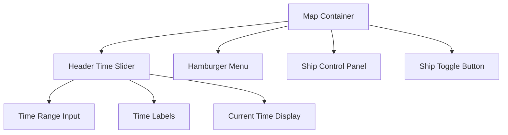
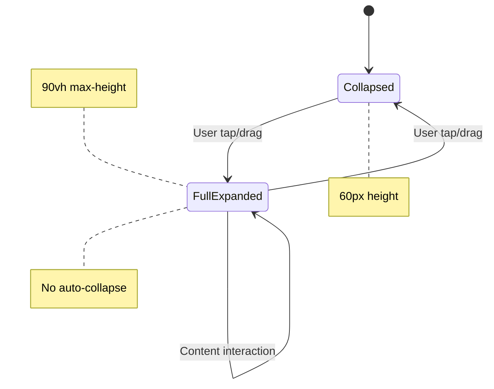
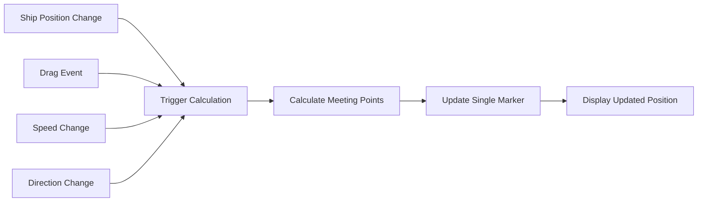
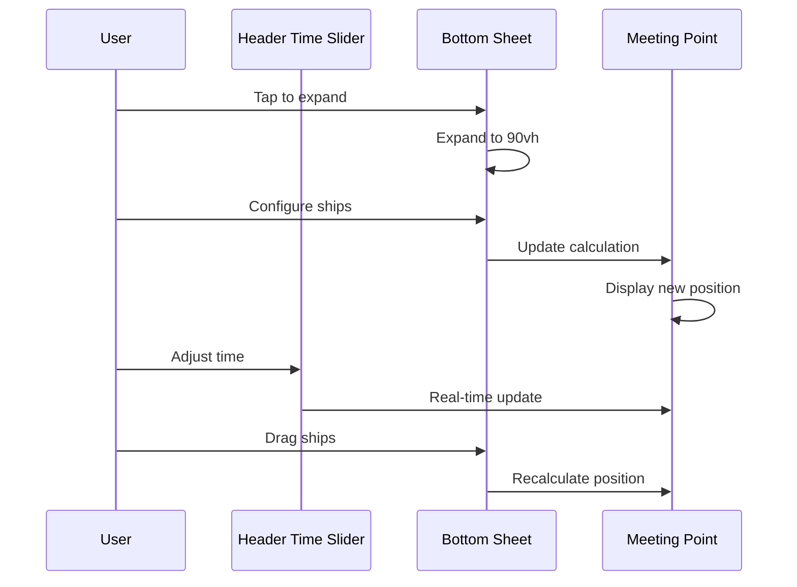

# UI Layout Adjustments Feature Request

## Overview

This design addresses critical UI/UX issues in the Istanbul Strait nautical map application, focusing on resolving component overlaps, improving mobile usability, and enhancing meeting point visualization. The improvements target three main areas: time slider repositioning, bottom sheet optimization, and dynamic meeting point calculation.

## Technology Stack & Dependencies

- **Frontend Framework**: Vanilla HTML/CSS/JavaScript (single-file architecture)
- **Map Library**: Leaflet.js 1.9.4
- **Styling**: CSS3 with mobile-first responsive design
- **Target Platform**: Mobile-only optimization

## Current Issues Analysis

### 1. Component Overlap Problem
- Floating time slider conflicts with bottom sheet when both are visible
- Time slider positioned at `bottom: 30px` overlaps with expanded bottom sheet
- Creates poor user experience and accessibility issues

### 2. Bottom Sheet Usability Issues
- Auto-collapse behavior interrupts user workflow
- Insufficient height causes scrolling requirement for content visibility
- Poor visual feedback for user interactions
- Complex state management between collapsed/expanded states

### 3. Meeting Point Visualization Problems
- Static markers don't update when ships are repositioned via drag-and-drop
- Multiple markers create visual clutter
- Meeting calculations don't reflect real-time position changes

## Component Architecture Redesign

### 1. Header Time Slider Integration



#### Implementation Strategy
- **Position**: Replace existing map title with integrated time slider
- **Location**: Top of screen (`top: 10px, left: 10px, right: 60px`)
- **Styling**: Nautical gradient background matching existing theme
- **Dimensions**: Compact height (`padding: 8px 12px`) for space efficiency

#### Technical Specifications
```css
.header-time-slider {
    position: absolute;
    top: 10px;
    left: 10px;
    right: 60px;
    z-index: 1000;
    background: linear-gradient(135deg, rgba(0, 0, 0, 0.9), rgba(0, 50, 100, 0.9));
    padding: 8px 12px;
    border-radius: 8px;
    border: 2px solid rgba(255, 255, 255, 0.3);
}
```

### 2. Bottom Sheet Enhancement Architecture



#### Design Improvements
- **Height Optimization**: Increase max-height to 90vh for full content visibility
- **Auto-Collapse Removal**: Eliminate automatic collapse behavior
- **Manual Control**: User-initiated expand/collapse only
- **Content Fitting**: Optimize form layouts to prevent scrolling

#### UI/UX Enhancements
- **Visual Feedback**: Enhanced drag handle with better touch response
- **Content Scaling**: Reduce font sizes and spacing for content optimization
- **State Persistence**: Maintain user-selected state between interactions

### 3. Dynamic Meeting Point System



#### Real-time Calculation Engine
- **Event Triggers**: Ship drag, speed change, direction change
- **Calculation Method**: Continuous position interpolation
- **Marker Strategy**: Single red marker for nearest meeting point
- **Update Frequency**: Immediate response to configuration changes

#### Visual Representation
- **Single Marker**: Red circular marker for primary meeting point
- **Dynamic Positioning**: Updates automatically with ship movements
- **Visual Clarity**: Remove multiple markers to reduce clutter

## Detailed Implementation Plan

### Phase 1: Time Slider Relocation

#### Step 1.1: Remove Existing Components
- Remove current floating time slider component
- Remove map title overlay
- Clean up associated CSS and JavaScript

#### Step 1.2: Create Header Time Slider
- Implement new header component with time controls
- Add responsive layout for mobile screens
- Integrate existing time functionality

#### Step 1.3: Synchronization
- Connect header slider to ship simulation system
- Maintain existing time range (0-60 minutes)
- Preserve current time display functionality

### Phase 2: Bottom Sheet Optimization

#### Step 2.1: CSS Restructuring
```css
.ship-control-panel.expanded {
    height: 90vh;
    max-height: 90vh;
}

.mobile-tab-content {
    overflow-y: visible;
    max-height: calc(90vh - 120px);
}
```

#### Step 2.2: Auto-Collapse Removal
- Remove setTimeout functions for auto-collapse
- Disable automatic state transitions
- Implement manual-only control system

#### Step 2.3: Content Optimization
- Reduce padding and margins in form elements
- Optimize font sizes for better space utilization
- Improve input field layouts

### Phase 3: Meeting Point Enhancement

#### Step 3.1: Calculation System Update
```javascript
function updateMeetingPoint() {
    // Clear existing markers
    clearMeetingMarkers();
    
    // Calculate new meeting point
    const meetingData = calculateNextMeetingPoint();
    
    // Display single marker
    if (meetingData.hasValidMeeting) {
        displayMeetingMarker(meetingData.position, meetingData.time);
    }
}
```

#### Step 3.2: Event Integration
- Connect to ship drag events
- Link to speed/direction change handlers
- Implement real-time update triggers

#### Step 3.3: Visual Optimization
- Create single, prominent meeting point marker
- Implement smooth marker transitions
- Add tooltip with meeting time information

## User Experience Flow

### New Interaction Pattern



### Key Improvements
1. **No Component Overlap**: Time slider in header eliminates conflicts
2. **Full Content Access**: 90vh bottom sheet removes scrolling need
3. **Manual Control**: User controls panel state without interruption
4. **Real-time Feedback**: Meeting points update immediately with changes

## Testing Strategy

### Functional Testing
- **Component Isolation**: Test each component independently
- **Integration Testing**: Verify component interactions
- **State Management**: Test expand/collapse behavior
- **Calculation Accuracy**: Validate meeting point algorithms

### Mobile Usability Testing
- **Touch Responsiveness**: Verify all touch targets meet 44px minimum
- **Visual Clarity**: Test readability across different screen sizes
- **Performance**: Ensure smooth animations and transitions
- **Gesture Support**: Validate drag and tap interactions

### Cross-Device Compatibility
- **Screen Sizes**: Test on various mobile screen dimensions
- **Orientation**: Verify landscape and portrait modes
- **Touch Precision**: Validate interaction accuracy
- **Visual Consistency**: Ensure uniform appearance

## Technical Considerations

### Performance Optimization
- **Debounced Updates**: Limit calculation frequency during rapid changes
- **Efficient DOM Manipulation**: Minimize reflow and repaint operations
- **Memory Management**: Proper cleanup of event listeners and markers

### Accessibility Improvements
- **Touch Targets**: Ensure minimum 44px interactive areas
- **Visual Contrast**: Maintain nautical theme with good readability
- **Responsive Design**: Adapt to various screen sizes and orientations

### Maintainability
- **Code Organization**: Separate concerns for easier maintenance
- **Event Management**: Clean event binding and unbinding
- **State Synchronization**: Centralized state management for components

## Expected Outcomes

### User Experience Improvements
- **Elimination of Component Conflicts**: No overlapping UI elements
- **Enhanced Usability**: Full content visibility without scrolling
- **Intuitive Controls**: Clear and responsive user interactions
- **Real-time Feedback**: Immediate visual updates to changes

### Technical Benefits
- **Simplified Architecture**: Cleaner component separation
- **Better Performance**: Optimized rendering and calculations
- **Improved Maintainability**: More organized code structure
- **Enhanced Reliability**: Reduced state management complexity

### Visual Enhancements
- **Professional Appearance**: Cleaner, more organized interface
- **Better Information Hierarchy**: Clear priority of information elements
- **Consistent Interactions**: Predictable user interface behavior
- **Modern Mobile Experience**: Touch-optimized design patterns